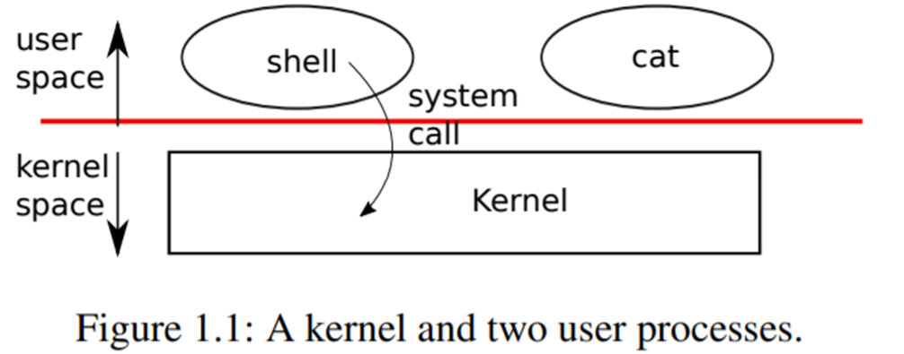

## 第一章：操作系统接口

   操作系统的工作是将计算机的资源在多个程序间共享，并且给程序提供一系列比硬件本身支持的更有用的服务。操作系统管理并抽象底层硬件，因此，举例来说，一个文字处理程序不需要去关心自己使用的是何种硬盘。操作系统还对硬件进行多路复用，使多个程序可以同时运行的(或者看起来是同时运行)。最后，操作系统为程序提供了一种可控的交互方式，使得多个程序可以共享数据，共同工作。

​    操作系统通过接口向用户程序提供服务。设计一个好的接口实际上是很困难的。一方面，我们希望接口简单和精准，这样它就容易正确地实现；另一方面，我们可能又想为应用提供许多更加复杂的功能。解决这种矛盾的诀窍是让接口的设计依赖于一些*机制* (*mechanism)*，并通过这些机制的组合来提供通用性。

​    本书以一个操作系统为例，来说明操作系统的概念。这个操作系统就是xv6，它提供了在Ken Thompson和Dennis Ritchie的Unix操作系统[14]中引入的基本接口，同时也模仿了Unix的内部设计。Unix提供了一个机制组合得非常良好的窄接口，具有惊人的通用性。这样的接口设计非常成功，这也使得BSD，Linux，Mac OS X，Solaris这样的现代操作系统，甚至Windows都有类似Unix的接口。理解xv6是理解这些操作系统的一个良好起点。

​    如图1.1所示，xv6使用了传统形式的**内核**——一个向其他运行中的程序提供服务的特殊程序。每一个正在运行的程序（称为**进程**），都拥有自己的包含指令、数据、栈的内存空间。指令实现程序的运算，数据是用于运算过程的变量，栈则管理程序的过程调用。一台计算机通常有许多进程，但只有一个内核。



​    当一个进程需要调用一个内核服务时，它就会调用**系统调用**，这是操作系统接口中的一个调用。系统调用会进入内核，让内核执行服务然后返回。所以进程会在用户空间和内核空间之间交替运行。

​    内核使用CPU[[1]](#ftn1)提供的硬件保护机制来确保在用户空间中执行的每个进程只能访问自己的内存。内核运行时拥有硬件特权，可以访问这些受到保护的资源，而用户程序运行时则没有这些特权。当用户程序调用系统调用时，硬件提高特权级别并开始执行内核中预定义的函数。

内核提供的系统调用集合就是用户程序可见的接口。xv6内核提供了传统Unix内核所提供的服务和系统调用的一个子集。图1.2列出了xv6的所有系统调用。

| 系统调用                                    | 描述                                                         |
| ------------------------------------------- | ------------------------------------------------------------ |
| **int fork()**                              | 创建一个进程，返回子进程的PID。                              |
| **int exit(int status)**                    | 终止当前进程，并将status传递给wait()。不会返回。             |
| **int wait(int \*status)**                  | 等待子进程结束，并将status接收到参数status中，返回其PID。   |
| **int kill(int pid)**                       | 终止给定PID的进程，成功返回0，失败返回-1。        |
| **int getpid()**                            | 返回当前进程的PID。                                          |
| **int sleep(int n)**                        | 睡眠n个时钟周期。                                            |
| **int exec(char \*file, char \*argv[])**    | 通过给定参数加载并执行一个文件；只在错误时返回。             |
| **char \*sbrk(int n)**                      | 使进程内存增加n字节，返回新内存的起始地址。                  |
| **int open(char \*file, int flags)**        | 打开一个文件，flags表示读或写，返回fd（文件描述符）。        |
| **int write(int fd, char \*buf, int n)**    | 将buf中n字节写入到文件描述符中；返回n。                      |
| **int read(int fd, char \*buf, int n)**     | 从文件描述符中读取n字节到buf；返回读取字节数，文件结束返回0。 |
| **int close(int fd)**                       | 释放文件描述符fd。                                           |
| **int dup(int fd)**                         | 返回一个新文件描述符，其引用与fd相同的文件。                 |
| **int pipe(int p[])**                       | 创建管道，将读/写文件描述符放置在p[0]和p[1]。                |
| **int chdir(char \*dir)**                   | 改变当前目录。                                               |
| **int mkdir(char \*dir)**                   | 创建新目录。                                                 |
| **int mknod(char \*file, int, int)**        | 创建新设备文件。                                             |
| **int fstat(int fd, struct stat \*st)**     | 将打开的文件的信息放置在*st中。                              |
| **int stat(char \*file, struct stat \*st)** | 将命名文件信息放置在*st中。                                  |
| **int link(char \*file1, char \* file2)**   | 为文件file1创建一个新的名称(file2)。                         |
| **int unlink(char \*file)**                 | 移除一个文件。                                               |

图1.2  xv6系统调用. 如果没有特别说明, 这些调用成功时返回0，失败时返回-1。

​    

​    本章剩下的部分概述了xv6的服务的概貌——进程、内存、文件描述符、管道和文件系统，并通过代码片段对其进行了说明，然后讨论了**shell**（Unix的命令行用户接口）中是如何使用它们的。这些系统调用在shell中的应用说明了系统调用的设计如何精巧。

​    shell是一个普通的程序，它从用户读取命令并执行它们。shell是一个用户程序，而不是内核的一部分，这一事实说明了系统调用接口的强大：shell没有什么特别之处。这也意味着shell是很容易被替换的;因此，事实上现代Unix系统中有各种各样的shell，每个都有自己的用户界面和脚本特性。xv6 shell是Unix Bourne shell的一个简单实现。它的实现可以在（`user/sh.c:1`）找到。

### 1.1 Processes and memory[1.1 进程和内存]

一个xv6进程由用户空间内存（指令、数据和堆栈）和内核私有的进程状态组成。Xv6对进程提供**分时**特性：它透明地切换当前cpu正在执行的进程。当一个进程暂时不使用cpu时，xv6会保存它的CPU寄存器，在下次运行该进程时恢复它们。内核为每个进程关联一个**PID**(进程标识符)。

 可以使用**fork**系统调用创建一个新的进程。**fork**创建的新进程被称为**子进程**，其内存内容与调用的进程完全相同，原进程被称为**父进程**。在父进程和子进程中，fork都会返回。在父进程中，fork返回子进程的PID；在子进程中，fork返回0。例如，考虑以下用C编程语言编写的程序片段[6]。

 ``` c
int* pid = fork();
if (pid > 0)
{
	printf("parent: child=%d\n", pid);
	pid = wait((*int* *)0);
	printf("child %d is done\n", pid);
}
else if (pid == 0)
{
	printf("child: exiting\n");
	exit(0);
}
else
{
	printf("fork error\n");
}
 ```

​    **exit**系统调用会使得调用它的进程退出，并释放资源，例如内存和打开的文件。**exit**需要一个整数状态参数，通常0表示成功，1表示失败。**wait**系统调用返回当前进程的一个已退出（或被杀死）的子进程的PID，并将该子进程的退出状态码复制到一个地址，该地址由wait参数提供；如果调用者的子进程都没有退出，则**wait**等待一个子进程退出。如果调用者没有子进程，wait立即返回-1。如果父进程不关心子进程的退出状态，可以传递一个0地址给wait。

​    在上面的例子中，输出为:

``` 
parent: child=1234
child: exiting
```

可能会以任何一种顺序输出，这取决于是父进程还是子进程先执行它的**printf**调用。在子程序退出后，父进程的**wait**返回，父进程打印：

```
child 1234 is done
```

虽然子进程最初与父进程拥有相同的内存内容，但父进程和子进程是在不同的内存和不同的寄存器中执行的：改变其中一个进程中的变量不会影响另一个进程。例如，当**wait**的返回值存储到父进程的**pid**变量中时，并不会改变子进程中的变量**pid**。子进程中的**pid**值仍然为零。

**exec**系统调用使用新内存映像来替换进程的内存， 新内存映像从文件系统中的文件中进行读取。这个文件必须有特定的格式，它指定了文件中哪部分存放指令，哪部分是数据，在哪条指令开始，等等。xv6使用ELF格式，第3章将详细讨论。当**exec**成功时，它并不返回到调用程序；相反，从文件中加载的指令在ELF头声明的入口点开始执行。**exec**需要两个参数：包含可执行文件的文件名和一个字符串参数数组。例如：

``` c
char* *argv[3];
argv[0] = "echo";
argv[1] = "hello";
argv[2] = 0;
exec("/bin/echo", argv);
printf("exec error\n");
```

  上述代码会执行/bin/echo程序，并将argv数组作为参数。大多数程序都会忽略参数数组的第一个元素，也就是程序名称。

xv6 shell使用上述调用来在用户空间运行程序。shell的主结构很简单，参见**main**(user/sh.c:145)。主循环用**getcmd**读取用户的一行输入，然后调用**fork**，创建shell副本。父进程调用wait，而子进程则运行命令。例如，如果用户向shell输入了**echo hello**，那么就会调用**runcmd**，参数为**echo hello**。**runcmd** (user/sh.c:58) 运行实际的命令。对于**echo hello**，它会调用**exec** (user/sh.c:78)。如果**exec**成功，那么子进程将执行echo程序的指令，而不是**runcmd**的。在某些时候，**echo**会调用**exit**，这将使父程序从main(user/sh.c:145)中的**wait**返回。

 你可能会奇怪为什么**fork**和**exec**没有结合在一次调用中，我们后面会看到shell在实现I/O重定向时利用了这种分离的特性。为了避免创建相同进程并立即替换它（使用exec）所带来的浪费，内核通过使用虚拟内存技术（如copy-on-write）来优化这种用例的fork实现（见4.6节）。

Xv6隐式分配大部分用户空间内存：**fork**复制父进程的内存到子进程，**exec**分配足够的内存来容纳可执行文件。一个进程如果在运行时需要更多的内存（可能是为了**malloc**），可以调用sbrk(n)将其数据内存增长n个字节；sbrk返回新内存的位置。

### 1.2 I/O and File descriptors[1.2 I/O 和文件描述符]

**文件描述符**是一个小整数，代表一个可由进程读取或写入的内核管理对象。一个进程可以通过打开一个文件、目录、设备，或者通过创建一个管道，或者通过复制一个现有的描述符来获得一个文件描述符。为了简单起见，我们通常将文件描述符所指向的对象称为文件；文件描述符接口将文件、管道和设备之间的差异抽象化，使它们看起来都像字节流。我们把输入和输出称为**I/O**。

在内部，xv6内核为每一个进程单独维护一个以文件描述符为索引的表，因此每个进程都有一个从0开始的文件描述符私有空间。按照约定，一个进程从文件描述符0(标准输入)读取数据，向文件描述符1(标准输出)写入输出，向文件描述符2(标准错误)写入错误信息。正如我们将看到的那样，shell利用这个约定来实现I/O重定向和管道。shell确保自己总是有三个文件描述符打开（user/sh.c:151），这些文件描述符默认是控制台的文件描述符。

**read**/**write**系统调用可以从文件描述符指向的文件读写数据。调用**read(fd, buf, n)**从文件描述符**fd**中读取不超过**n**个字节的数据，将它们复制到**buf**中，并返回读取的字节数。每个引用文件的文件描述符都有一个与之相关关联偏移量。**read**从当前文件偏移量中读取数据，然后按读取的字节数推进偏移量，随后的**read**将返回上次读取之后的数据。当没有更多的字节可读时，读返回零，表示文件结束。

**write(fd, buf, n)**表示将**buf**中的**n**个字节写入文件描述符**fd**中，并返回写入的字节数。若写入字节数小于n则该次写入发生错误。和**read**一样，**write**在当前文件偏移量处写入数据，然后按写入的字节数将偏移量向前推进：每次**write**都从上一次写入的地方开始。

下面的程序片段(程序**cat**的核心代码)将数据从其标准输入复制到其标准输出。如果出现错误，它会向标准错误写入一条消息。

``` c
char buf[512];
int n;
for (;;)
{
    n = read(0, buf, sizeof buf);
    if (n == 0)
        break;
    if (n < 0)
    {
        fprintf(2, "read error\n");
        exit(1);
    }
    if (write(1, buf, n) != n)
    {
        fprintf(2, "write error\n");
        exit(1);
	}
}
```

在这个代码片段中，需要注意的是，**cat**不知道它是从文件、控制台还是管道中读取的。同样，**cat**也不知道它是在打印到控制台、文件还是其他什么地方。文件描述符的使用和0代表输入，1代表输出的约定，使得**cat**可以很容易实现。

**close**系统调用会释放一个文件描述符，使它可以被以后的**open**、**pipe**或**dup**系统调用所重用（见下文）。新分配的文件描述符总是当前进程中最小的未使用描述符。

文件描述符和**fork**相互作用，使I/O重定向易于实现。**fork**将父进程的文件描述符表和它的内存一起复制，这样子进程开始时打开的文件和父进程完全一样。系统调用**exec**替换调用进程的内存，但会保留文件描述符表。这种行为允许shell通过**fork**实现I/O重定向，在子进程中重新打开所选的文件描述符，然后调用**exec**运行新程序。下面是shell运行**cat < input.txt**命令的简化版代码。

```c
char *argv[2];
argv[0] = "cat";
argv[1] = 0;
if (fork() == 0)
{
    close(0);  // 释放标准输入的文件描述符
    open("input.txt", O_RDONLY);  // 这时input.txt的文件描述符为0
    // 即标准输入为input.txt
    exec("cat", argv);  // cat从0读取，并输出到1，见上个代码段
}
```

在子进程关闭文件描述符0后，**open**保证对新打开的**input.txt**使用该文件描述符0。因为此时0将是最小的可用文件描述符。然后**cat**执行时，文件描述符0（标准输入）会指向**input.txt**。这不会改变父进程的文件描述符，它只会修改子进程的描述符。

xv6 shell中的I/O重定向代码正是以这种方式工作的（user/sh.c:82）。回想一下shell的代码，shell已经**fork**子shell，**runcmd**将调用**exec**来加载新的程序。

**open**的第二个参数由一组用位表示的标志组成，用来控制**open**的工作。可能的值在文件控制(fcntl)头(kernel/fcntl.h:1-5)中定义。**O_RDONLY,** **O_WRONLY,** **O_RDWR**, **O_CREATE**, 和 **O_TRUNC,** 它们分别指定open打开文件时的功能，读、写、读和写、如果文件不存在则创建文件、将文件长度截断为0。

现在应该清楚为什么**fork**和**exec**是分开调用的：在这两个调用之间，shell有机会重定向子进程的I/O，而不干扰父进程的I/O设置。我们可以假设一个由**fork**和**exec**组成的系统调用**forkexec**，但是用这种调用来做I/O重定向似乎很笨拙。shell在调用**forkexec**之前修改自己的I/O设置（然后取消这些修改），或者**forkexec**可以将I/O重定向的指令作为参数，或者（最糟糕的方案）每个程序（比如cat）都需要自己做I/O重定向。

虽然**fork**复制了文件描述符表，但每个底层文件的偏移量都是父子共享的。想一想下面的代码。

``` c
 if (fork() == 0)
 {
     write(1, "hello ", 6);
     exit(0);
 }
else
{
    wait(0);
    write(1, "world\n", 6);
}
```

在这个片段的最后，文件描述符1所引用的文件将包含数据hello world。父进程中的**write**（由于有了**wait**，只有在子进程结束后才会运行）会从子进程的**write**结束的地方开始。这种行为有助于从shell命令的序列中产生有序的输出，比如**(echo hello; echo world) >output.txt**。

**dup**系统调用复制一个现有的文件描述符，返回一个新的描述符，它指向同一个底层I/O对象。两个文件描述符共享一个偏移量，就像被**fork**复制的文件描述符一样。这是将hello world写进文件的另一种方法。

``` c
fd = dup(1);
write(1, "hello ", 6);
write(fd, "world\n", 6);
```

如果两个文件描述符是通过一系列的**fork**和**dup**调用从同一个原始文件描述符衍生出来的，那么这两个文件描述符共享一个偏移量。否则，文件描述符不共享偏移量，即使它们是由同一个文件的打开调用产生的。**dup**允许shell实现这样的命令：l**s existing-file non-existing-file > tmp1 2>&1**。2>&1表示2是1的复制（**dup(1)**），即重定向错误信息到标准输出，已存在文件的名称和不存在文件的错误信息都会显示在文件tmp1中。xv6 shell不支持错误文件描述符的I/O重定向，但现在你知道如何实现它了。

文件描述符是一个强大的抽象，因为它们隐藏了它们连接的细节：一个向文件描述符1写入的进程可能是在向一个文件、控制台等设备或向一个管道写入。

### 1.3 Pipes[1.3 管道]

**管道**是一个小的内核缓冲区，作为一对文件描述符提供给进程，一个用于读，一个用于写。将数据写入管道的一端就可以从管道的另一端读取数据。管道为进程提供了一种通信方式。

下面的示例代码运行程序wc，标准输入连接到管道的读取端。

``` c
int p[2];
char *argv[2];
argv[0] = "wc";
argv[1] = 0;
pipe(p);
if (fork() == 0)
{
    close(0);  // 释放文件描述符0
    dup(p[0]); // 复制一个p[0](管道读端)，此时文件描述符0（标准输入）也引用管道读端，故改变了标准输入。
    close(p[0]);
    close(p[1]);
    exec("/bin/wc", argv); // wc 从标准输入读取数据，并写入到参数中的每// 一个文件
}
else
{
    close(p[0]);
    write(p[1], "hello world\n", 12);
    close(p[1]);
}
```

程序调用**pipe**，创建一个新的管道，并将读写文件描述符记录在数组**p**中，经过**fork**后，父进程和子进程的文件描述符都指向管道。子进程调用**close**和**dup**使文件描述符0引用管道的读端，并关闭p中的文件描述符，并调用**exec**运行**wc**。当**wc**从其标准输入端读取时，它将从管道中读取。父进程关闭管道的读端，向管道写入，然后关闭写端。

如果没有数据可用，管道上的**read**会等待数据被写入，或者等待所有指向写端的文件描述符被关闭；在后一种情况下，读将返回0，就像数据文件的结束一样。事实上，如果没有数据写入，读会无限阻塞，直到新数据不可能到达为止（写端被关闭），这也是子进程在执行上面的**wc**之前关闭管道的写端很重要的一个原因：如果wc的一个文件描述符仍然引用了管道的写端，那么**wc**将永远看不到文件的关闭（被自己阻塞）。

xv6的shell实现了管道，如**grep fork sh.c | wc -l**，shell的实现类似于上面的代码（user/sh.c:100）。执行shell的子进程创建一个管道来连接管道的左端和右端（去看源码，不看难懂）。然后，它在管道左端（写入端）调用**fork**和**runcmd**，在右端（读取端）调用**fork**和**runcmd**，并等待两者结束。管道的右端（读取端）可以是一个命令，也可以是包含管道的多个命令（例如，**a | b | c**），它又会分叉为两个新的子进程（一个是**b**，一个是**c**）。因此，shell可以创建一棵进程树。这棵树的叶子是命令，内部（非叶子）节点是等待左右子进程结束的进程。

原则上，我们可以让内部节点（非叶节点）运行管道的左端，但这样的实现会更加复杂。考虑只做以下修改：修改sh.c，使其不为**runcmd(p->left)**  fork进程，直接递归运行**runcmd(p->left)**。像这样，**echo hi | wc**不会产生输出，因为当**echo hi**在**runcmd**中退出时，内部进程会退出，而不会调用**fork**来运行管道的右端。这种不正确的行为可以通过不在**runcmd**中为内部进程调用**exit**来修正，但是这种修正会使代码变得复杂：**runcmd**需要知道该进程是否是内部进程（非叶节点）。当不为**runcmd(p->right)**  **fork**进程时，也会出现复杂的情况。像这样的修改，**sleep 10 | echo hi**就会立即打印出hi，而不是10秒后，因为**echo**会立即运行并退出，而不是等待**sleep**结束。由于sh.c的目标是尽可能的简单，所以它并没有试图避免创建内部进程。

管道似乎没有比临时文件拥有更多的功能：

``` shell
echo hello world | wc
```

不使用管道：

``` shell
echo hello world >/tmp/xyz; wc </tmp/xyz
```

在这种情况下，管道比临时文件至少有四个优势。首先，管道会自动清理自己；如果是文件重定向，shell在完成后必须小心地删除/tmp/xyz。第二，管道可以传递任意长的数据流，而文件重定向则需要磁盘上有足够的空闲空间来存储所有数据。第三，管道可以分阶段的并行执行，而文件方式则需要在第二个程序开始之前完成第一个程序。第四，如果你要实现进程间的通信，管道阻塞读写比文件的非阻塞语义更有效率。

### 1.4 File system[1.4 文件系统]

xv6文件系统包含了数据文件（拥有字节数组）和目录（拥有对数据文件和其他目录的命名引用）。这些目录形成一棵树，从一个被称为根目录的特殊目录开始。像**/a/b/c**这样的路径指的是根目录**/**中的**a**目录中的**b**目录中的名为**c**的文件或目录。不以**/**开头的路径是相对于调用进程的当前目录进行计算其绝对位置的，可以通过**chdir**系统调用来改变进程的当前目录。下面两个**open**打开了同一个文件（假设所有涉及的目录都存在）。

``` c
chdir("/a");
chdir("b");
open("c", O_RDONLY);
open("/a/b/c", O_RDONLY);
```

前两行将进程的当前目录改为**/a/b**；后面两行既不引用也不改变进程的当前目录。

有一些系统调用来可以创建新的文件和目录：**mkdir**创建一个新的目录，用**open**加上**O_CREATE**标志创建并打开一个新的数据文件，以及**mknod**创建一个新的设备文件。这个例子说明了这三个系统调用的使用。

```c
mkdir("/dir");
fd = open("/dir/file", O_CREATE | O_WRONLY);
close(fd);

mknod("/console", 1, 1);
```

**mknod**创建了一个引用设备的特殊文件。与设备文件相关联的是主要设备号和次要设备号(**mknod**的两个参数)，它们唯一地标识一个内核设备。当一个进程打开设备文件后，内核会将系统的读写调用转移到内核设备实现上，而不是将它们传递给文件系统。

文件名称与文件是不同的；底层文件（非磁盘上的文件）被称为**inode**，一个inode可以有多个名称，称为**链接**。每个链接由目录中的一个项组成；该项包含一个文件名和对inode的引用。inode保存着一个文件的***metadata\***（元数据），包括它的类型（文件或目录或设备），它的长度，文件内容在磁盘上的位置，以及文件的链接数量。

**fstat**系统调用从文件描述符引用的inode中检索信息。它定义在**stat.h** (kernel/stat.h)的 **stat** 结构中：

``` c
#define T_DIR 1    	// Directory
#define T_FILE 2   	// File
#define T_DEVICE 3 	// Device
struct stat
{
    int dev;     	// File system’s disk device
    uint ino;    	// Inode number
    short type;  	// Type of file
    short nlink; 	// Number of links to file
    uint64 size; 	// Size of file in bytes
};
```

**link**系统调用创建了一个引用了同一个inode的文件（文件名）。下面的片段创建了引用了同一个inode两个文件a和b。

```c
open("a", O_CREATE | O_WRONLY);
link("a", "b");
```

读写a与读写b是一样的，每个inode都有一个唯一的inode号来标识。经过上面的代码序列后，可以通过检查fstat的结果来确定a和b指的是同一个底层内容：两者将返回相同的inode号（**ino**），并且nlink计数为2。

**unlink**系统调用会从文件系统中删除一个文件名。只有当文件的链接数为零且没有文件描述符引用它时，文件的inode和存放其内容的磁盘空间才会被释放。

``` c
unlink("a");
```

上面这行代码会删除a，此时只有b会引用inode。

``` c
fd = open("/tmp/xyz", O_CREATE | O_RDWR);
unlink("/tmp/xyz");
```

这段代码是创建一个临时文件的一种惯用方式，它创建了一个无名称inode，故会在进程关闭**fd**或者退出时删除文件。

Unix提供了shell可调用的文件操作程序，作为用户级程序，例如**mkdir**、**ln**和**rm**。这种设计允许任何人通过添加新的用户级程序来扩展命令行接口。现在看来，这个设计似乎是显而易见的，但在Unix时期设计的其他系统通常将这类命令内置到shell中（并将shell内置到内核中）。

有一个例外，那就是cd，它是在shell中实现的 (user/sh.c:160)。cd 必须改变 shell 自身的当前工作目录。如果cd作为一个普通命令执行，那么shell就会fork一个子进程，而子进程会运行cd，cd只会改变子进程的当前工作目录。父进程（即shell）的工作目录则保持不变。

### 1.5 Real world[1.5 现实情况]

Unix将标准文件描述符、管道和方便的shell语法结合起来进行操作，是编写通用可重用程序的一大进步。这个想法引发了一种“软件工具”文化，这也是Unix强大和流行的主要原因，而shell是第一种所谓的脚本语言。Unix系统调用接口今天仍然存在于BSD、Linux和Mac OS X等操作系统中。

Xv6并不符合 POSIX 标准：它缺少许多系统调用（包括基本的系统调用，如 **lseek**），而且它提供的许多系统调用与标准不同。我们对xv6的主要目标是简单明了，同时提供一个简单的类似UNIX的系统调用接口。一些人已经添加了一些系统调用和一个简单的C库扩展了xv6，以便运行基本的Unix程序。然而，现代内核比xv6提供了更多的系统调用和更多种类的内核服务。例如，它们支持网络、窗口系统、用户级线程、许多设备的驱动程序等等。现代内核不断快速发展，并提供了许多超越POSIX的功能。

Unix用一套文件名和文件描述符接口统一了对多种类型资源（文件、目录和设备）的访问。这个思想可以扩展到更多种类的资源，一个很好的例子是Plan 9项目[13]，它把资源就是文件的概念应用到网络、图形等方面。然而，大多数Unix衍生的操作系统都没有遵循这一路线。

文件系统和文件描述符已经是强大的抽象。即便如此，操作系统接口还有其他模式。Multics是Unix的前身，它以一种使文件存储看起来像内存的方式抽象了文件存储，产生了一种截然不同的接口。Multics设计的复杂性直接影响了Unix的设计者，他们试图建立一些更简单的东西。

Xv6没有用户系统；用Unix的术语来说，所有的xv6进程都以root身份运行。

本书研究的是xv6如何实现其类似Unix的接口，但其思想和概念不仅仅适用于Unix。任何操作系统都必须将进程复用到底层硬件上，将进程相互隔离，并提供受控进程间通信的机制。在学习了xv6之后，您应该能够研究其他更复杂的操作系统，并在这些系统中看到xv6中蕴含的基本概念。

### 1.6 Exercises[1.6 练习]

1. 使用UNIX的系统调用编写一个程序，通过一对管道在两个进程之间交换一个字节，每个方向各一个。以交换次数/秒为单位测量程序的性能。


-----


1. <a name="ftn1"></a>本文一般用CPU中央处理单元的缩写来指代执行计算的硬件单元。其他文本(如RISC-V规范)也使用processor、core和hart等词代替CPU。