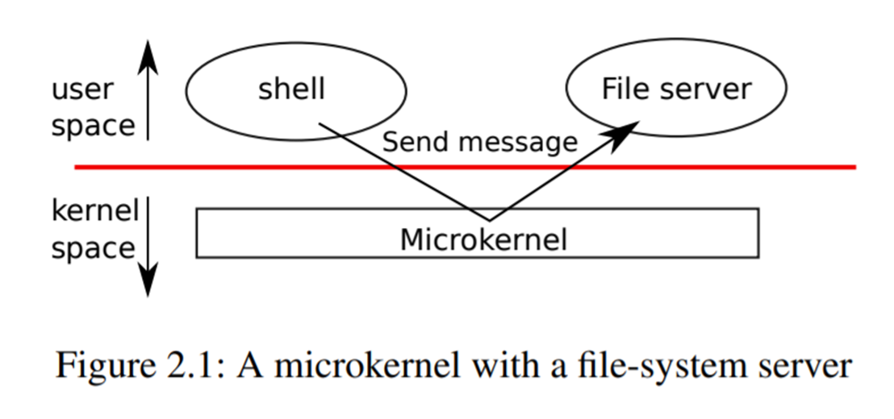
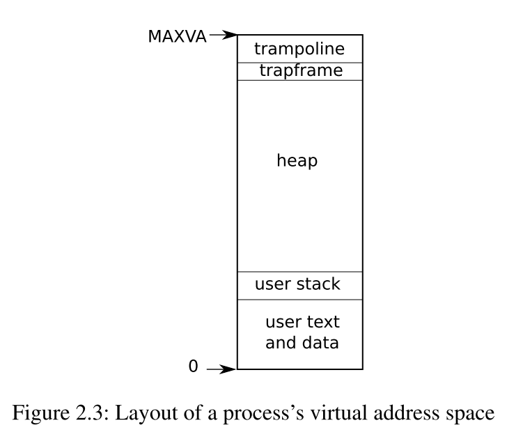

## 0.1 第二章：操作系统组织

操作系统的一个关键要求是同时支持几个活动。例如，使用第1章中描述的系统调用接口，一个进程可以用**fork**创建新进程。操作系统必须在这些进程之间分时共享计算机的资源。例如，即使进程的数量多于硬件CPU的数量，操作系统也必须保证所有的进程都有机会执行。操作系统还必须安排进程之间的隔离。也就是说，如果一个进程出现了bug并发生了故障，其不应该影响不依赖该bug进程的进程。然而，完全隔离也不可取，因为进程间可能需要进行交互，例如管道。因此，*一个操作系统必须满足三个要求：多路复用、隔离和交互*。

本章概述了如何组织操作系统来实现这三个要求。现实中有很多方法，但本文主要介绍以宏内核[[1]](#ftn1)为中心的主流设计，很多Unix操作系统都采用这种设计。本章还介绍了xv6进程的概述，xv6进程是xv6中的隔离单元，还介绍了xv6启动时第一个进程的创建。

Xv6运行在多核[[2]](#ftn2)RISC-V微处理器上，它的许多底层功能（例如，它的进程实现）是RISC-V所特有的。RISC-V是一个64位的CPU，xv6是用 "LP64 "C语言编写的，这意味着C编程语言中的long(L)和指针(P)是64位的，但int是32位的。本书假定读者在某种架构上做过一点机器级的编程，并会介绍一些RISC-V特有的思想。RISC-V有用的参考资料是 "The RISC-V Reader,An Open Architecture Attlas"［12］。用户级ISA[2]和特权架构[1]是官方规范。

一台完整的计算机中的CPU被支持它的硬件所包围，这些硬件大部分呈I/O接口的形式。编写XV6时，支撑它的硬件是通过带"-machine virt "选项的qemu模拟出来的。其中包括RAM、包含启动代码的ROM、与用户键盘/屏幕的串行连接以及用于存储的磁盘。

### 0.1.1 Abstracting physical resources

​    遇到一个操作系统，人们可能会问的第一个问题是为什么需要它呢？答案是，我们可以把图1.2中的系统调用作为一个库来实现，应用程序与之连接。在这个想法中，每个应用程序可以根据自己的需要定制自己的库。应用程序可以直接与硬件资源进行交互，并以最适合应用程序的方式使用这些资源（例如，实现高效、可预测的性能）。一些用于嵌入式设备或实时系统的操作系统就是以这种方式组织的。

这种系统库方式的缺点是，如果有多个应用程序在运行，这些应用程序必须正确执行。例如，每个应用程序必须定期放弃CPU，以便其他应用程序能够运行。如果所有的应用程序都相互信任并且没有bug，这样的***cooperative***分时方案可能是OK的。更典型的情况是，应用程序之间互不信任，并且有bug，所以人们通常希望比***cooperative***方案提供更强的隔离性。

为了实现强隔离，禁止应用程序直接访问敏感的硬件资源，而将资源抽象为服务是很有帮助的。例如，Unix应用程序只通过文件系统的`open`、`read`、`write`和`close`系统调用与文件系统进行交互，而不是直接读写磁盘。这为应用程序带来了路径名的便利，而且它允许操作系统（作为接口的实现者）管理磁盘。即使不考虑隔离问题，那些有意交互的程序（或者只是希望互不干扰）很可能会发现文件系统是一个比直接使用磁盘更方便的抽象。

同样，Unix在进程之间透明地切换硬件CPU，必要时保存和恢复寄存器状态，这样应用程序就不必意识到时间共享。这种透明性允许操作系统共享CPU，即使一些应用程序处于无限循环中。

另一个例子是，Unix进程使用`exec`来建立它们的内存映像，而不是直接与物理内存交互。这使得操作系统可以决定将进程放在内存的什么位置；如果内存紧张，操作系统甚至可能将进程的部分数据存储在磁盘上。`exec`还允许用户将可执行文件储存在文件系统中。

Unix进程之间的许多形式的交互都是通过文件描述符进行的。文件描述符不仅可以抽象出许多细节（例如，管道或文件中的数据存储在哪里），而且它们的定义方式也可以简化交互。例如，如果管道中的一个应用程序崩溃了，内核就会为管道中的另一个进程产生一个文件结束信号。

图1.2中的系统调用接口经过精心设计，既为程序员提供了便利，又提供了强隔离的可能。Unix接口并不是抽象资源的唯一方式，但事实证明它是一种非常好的方式。

### 0.1.2 User mode, supervisor mode, and system calls

强隔离要求应用程序和操作系统之间有一个分界线。如果应用程序发生错误，我们不希望操作系统崩溃，也不希望其他应用程序崩溃。相反，操作系统应该能够清理崩溃的应用程序并继续运行其他应用程序。为了实现强隔离，操作系统必须安排应用程序不能修改（甚至不能读取）操作系统的数据结构和指令，应用程序不能访问其他进程的内存。

*CPU提供了强隔离的硬件支持*。例如，RISC-V有三种模式，CPU可以执行指令：**机器模式**、**监督者（supervisor）模式**和**用户模式**。*在机器模式下执行的指令具有完全的权限*，一个*CPU在机器模式下启动*。*机器模式主要用于配置计算机*。Xv6会在机器模式下执行几条指令，然后转为监督者模式。

在*监督者（supervisor）模式下，CPU被允许执行特权指令*：例如，启用和禁用中断，读写保存页表地址的寄存器等。*如果用户模式下的应用程序试图执行一条特权指令，CPU不会执行该指令，而是切换到监督者模式，这样监督者模式的代码就可以终止该应用程序，因为它做了不该做的事情*。第1章的图1.1说明了这种组织方式。一个应用程序只能执行用户模式的指令（如数字相加等），被称为运行在用户空间，而处于监督者模式的软件也可以执行特权指令，被称为运行在内核空间。运行在内核空间（或监督者模式）的软件称为内核。

一个应用程序如果要调用内核函数（如xv6中的`read`系统调用），必须过渡到内核。CPU提供了一个特殊的指令，可以将CPU从用户模式切换到监督者模式，并在内核指定的入口处进入内核。(RISC-V为此提供了`ecall`指令。)一旦CPU切换到监督者模式，内核就可以验证系统调用的参数，决定是否允许应用程序执行请求的操作，然后拒绝或执行该操作。由内核控制监督者模式的入口点是很重要的；如果应用程序可以决定内核的入口点，那么恶意应用程序就能够在跳过参数验证的情况下进入内核。

### 0.1.3 Kernel organization

一个关键的设计问题是操作系统的哪一部分应该在监督者模式下运行。一种可能是整个操作系统驻留在内核中，这样所有系统调用的实现都在监督者模式下运行。这种组织方式称为***宏内核***。

在这种组织方式中，整个操作系统以全硬件权限运行。这种组织方式很方便，因为操作系统设计者不必决定操作系统的哪一部分不需要全硬件权限。此外，操作系统的不同部分更容易合作。例如，一个操作系统可能有一个缓冲区，其被缓存文件系统和虚拟内存系统共享。

宏内核组织方式的一个缺点是操作系统的不同部分之间的接口通常是复杂的（我们将在本文的其余部分看到），因此操作系统开发者很容易在这上面出错。在宏内核中，一个错误是致命的，因为监督者模式下的错误往往会导致内核崩溃。如果内核崩溃，计算机就会停止工作，因此所有的应用程序也会崩溃。计算机必须重启。

为了降低内核出错的风险，操作系统设计者可以尽量减少在监督者模式下运行的操作系统代码量，而*在用户模式下执行操作系统的大部分代码*。这种内核组织方式称为***微内核***。

图2.1说明了这种微内核设计。在图中，文件系统作为一个用户级进程运行。作为进程运行的OS服务称为服务器。为了让应用程序与文件服务器进行交互，内核提供了一种进程间通信机制，用于从一个用户模式进程向另一个进程发送消息。例如，如果一个像shell这样的应用程序想要读写文件，它就会向文件服务器发送一个消息，并等待响应。

在微内核中，内核接口由一些低级函数组成，用于启动应用程序、发送消息、访问设备硬件等。这种组织方式使得内核相对简单，因为大部分操作系统驻留在用户级服务器中。

xv6和大多数Unix操作系统一样，是以宏内核的形式实现的。因此，xv6内核接口与操作系统接口相对应，内核实现了完整的操作系统。由于xv6不提供很多服务，所以它的内核比一些微内核要小，但从概念上讲xv6是宏内核。

### 0.1.4 Code: xv6 organization

xv6内核源码在`kernel/`子目录下。按照模块化的概念，源码被分成了多个文件，图2.2列出了这些文件。模块间的接口在`kernel/defs.h`中定义。

### 0.1.5 Process overview

xv6中的隔离单位（和其他Unix操作系统一样）是一个进程。进程抽象可以防止一个进程破坏或监视另一个进程的内存、CPU、文件描述符等。它还可以防止进程破坏内核，所以进程不能破坏内核的隔离机制。内核必须小心翼翼地实现进程抽象，因为一个错误或恶意的应用程序可能会欺骗内核或硬件做一些不好的事情（例如，规避隔离）。内核用来实现进程的机制包括：用户/监督模式标志、地址空间和线程的时间片轮转。

为了帮助实施隔离，进程抽象为程序提供了一种错觉，即它有自己的私有机器。一个进程为程序提供了一个看似私有的内存系统，或者说是地址空间，其他进程不能对其进行读写。进程还为程序提供了“私有”的CPU，用来执行程序的指令。

Xv6使用页表（由硬件实现）给每个进程提供自己的地址空间。RISC-V页表将**虚拟地址**（RISC-V指令操作的地址）转换（或 "映射"）为**物理地址**（CPU芯片发送到主存储器的地址）。

Xv6为每个进程维护一个单独的页表，定义该进程的地址空间。如图2.3所示，进程的用户空间内存的地址空间是从虚拟地址0开始的。指令存放在最前面，其次是全局变量，然后是栈，最后是一个堆区（用于**malloc**），进程可以根据需要扩展。有一些因素限制了进程地址空间的最大长度：RISC-V上的指针是64位宽；硬件在页表中查找虚拟地址时只使用低的39位；xv6只使用39位中的38位。因此，最大地址是$2^{38}-1$ = 0x3fffffffff，也就是`MAXVA`（kernel/riscv.h:348）。在地址空间的顶端，xv6保留了一页，用于**trampoline**和映射进程**trapframe**的页，以便切换到内核，我们将在第4章中解释。

xv6内核为每个进程维护了许多状态，记录在`proc`结构体(kernel/proc.h:86)。一个进程最重要的内核状态是它的页表、内核栈和运行状态。我们用`p->xxx`来表示`proc`结构的元素，例如，`p->pagetable`是指向进程页表的指针。

每个进程都有一个执行线程（简称线程），执行进程的指令。一个线程可以被暂停，然后再恢复。为了在进程之间透明地切换，内核会暂停当前运行的线程，并恢复另一个进程的线程。线程的大部分状态（局部变量、函数调用返回地址）都存储在线程的栈中。每个进程有两个栈：用户栈和内核栈（`p->kstack`）。当进程在执行用户指令时，只有它的用户栈在被使用，而它的内核栈是空的。当进程进入内核时（因为系统调用或中断），内核代码在进程的内核栈上执行；当进程在内核中时，它的用户栈仍然包含保存的数据，但不被主动使用。进程的线程在用户栈和内核栈中交替执行。内核栈是独立的（并且受到保护，不受用户代码的影响），所以即使一个进程用户栈被破坏了，内核也可以执行。

一个进程可以通过执行RISC-V `ecall`指令进行系统调用。该指令提高硬件权限级别，并将程序计数器改变为内核定义的入口点。入口点的代码会切换到内核栈，并执行实现系统调用的内核指令。当系统调用完成后，内核切换回用户栈，并通过调用`sret`指令返回用户空间，降低硬件特权级别，恢复执行系统调用前的用户指令。进程的线程可以在内核中阻塞等待I/O，当I/O完成后，再从离开的地方恢复。

`p->state`表示进程是创建、就绪、运行、等待I/O，还是退出。

`p->pagetable`以RISC-V硬件需要的格式保存进程的页表，当进程在用户空间执行时，xv6使分页硬件使用进程的`p->pagetable`。进程的页表也会记录分配给该进程内存的物理页地址。

### 0.1.6 Code: starting xv6 and the first process

为了使xv6更加具体，我们将概述内核如何启动和运行第一个进程。后面的章节将更详细地描述这个概述中出现的机制。

当RISC-V计算机开机时，它会初始化自己，并运行一个存储在*只读存储器*中的**boot loader**。**Boot loader***将xv6内核加载到内存*中。然后，在*机器模式*下，CPU从 `_entry`（kernel/entry.S:6）开始执行xv6。RISC-V*在禁用分页硬件的情况下启动：虚拟地址直接映射到物理地址*。

loader将xv6内核加载到物理地址`0x80000000`的内存中。之所以将内核放在`0x80000000`而不是`0x0`，是因为地址范围`0x0:0x80000000`包含I/O设备。

`_entry`处的指令设置了一个栈，这样xv6就可以运行C代码。Xv6在文件`start.c`(kernel/start.c:11)中声明了初始栈的空间，即`stack0`。在`_entry`处的代码加载栈指针寄存器`sp`，地址为`stack0+4096`，也就是栈的顶部，因为RISC-V的栈是向下扩张的。现在内核就拥有了栈，`_entry`调用`start`(kernel/start.c:21)，并执行其C代码。

函数`start`执行一些只有在机器模式下才允许的配置，然后切换到监督者模式。*为了进入监督者模式，RISC-V提供了指令*`mret`。这条指令*最常用来从上一次的调用中返回*，上一次调用从监督者模式到机器模式。`start`并不是从这样的调用中返回，而是把事情设置得像有过这样的调用一样：它在寄存器`mstatus`中把*上一次的特权模式设置为特权者模式*，它把`main`的地址写入寄存器`mepc`中，把返回地址设置为`main`函数的地址，在特权者模式中把`0`写入页表寄存器`satp`中，禁用虚拟地址转换，并*把所有中断和异常委托给特权者模式*。

在进入特权者模式之前，`start`还要执行一项任务：*对时钟芯片进行编程以初始化定时器中断*。在完成了这些基本管理后，`start`通过调用`mret`“返回”到监督者模式。这将导致程序计数器变为`main`（kernel/main.c:11）的地址。

在`main`(kernel/main.c:11)初始化几个设备和子系统后，它通过调用`userinit`(kernel/proc.c:212)来创建第一个进程。第一个进程执行一个用RISC-V汇编编写的小程序`initcode.S`（user/initcode.S:1），它通过调用`exec`系统调用重新进入内核。正如我们在第一章中所看到的，`exec`用一个新的程序（本例中是`/init`）替换当前进程的内存和寄存器。

一旦内核完成`exec`，它就会在`/init`进程中返回到用户空间。`init` (user/init.c:15)在需要时会创建一个新的控制台设备文件，然后以文件描述符0、1和2的形式打开它。然后它在控制台上启动一个shell。这样系统就启动了。

### 0.1.7 Real world

在现实世界中，既可以找到宏内核，也可以找到微内核。许多Unix内核都是宏内核。例如，Linux的内核，尽管有些操作系统的功能是作为用户级服务器运行的（如windows系统）。L4、Minix和QNX等内核是以服务器的形式组织的微内核，并在嵌入式环境中得到了广泛的部署。大多数操作系统都采用了进程概念，大多数进程都与xv6的相似。

然而，现代操作系统支持进程可以拥有多个线程，以允许一个进程利用多个CPU。在一个进程中支持多个线程涉及到不少xv6没有的机制，包括潜在的接口变化(如Linux的`clone`，`fork`的变种)，以控制线程所共享进程的那些部分。

### 0.1.8 Exercises

1、你可以使用gdb来观察kernel mode到user mode的第一次转换。运行`make qemu-gdb`。在同一目录下的另一个窗口中，运行`gdb`。输入gdb命令`break *0x3ffffff10e`，这将在内核中跳转到用户空间的`sret`指令处设置一个断点。输入`continue` gdb命令，gdb应该在断点处停止，并即将执行`sret`。gdb现在应该显示它正在地址0x0处执行，该地址在`initcode.S`的用户空间开始处。

------

1. 与微内核设计理念相对应的理念，这也是一个源自操作系统级别的概念。对于宏内核来说，整个操作系统就是一个整体，包括了进程管理、内存管理、文件系统等等

2.  本文所说的 "多核 "是指多个共享内存但并行执行的CPU，每个CPU都有自己的一套寄存器。本文有时使用多处理器一词作为多核的同义词，但多处理器也可以更具体地指具有多个不同处理器芯片的计算机。