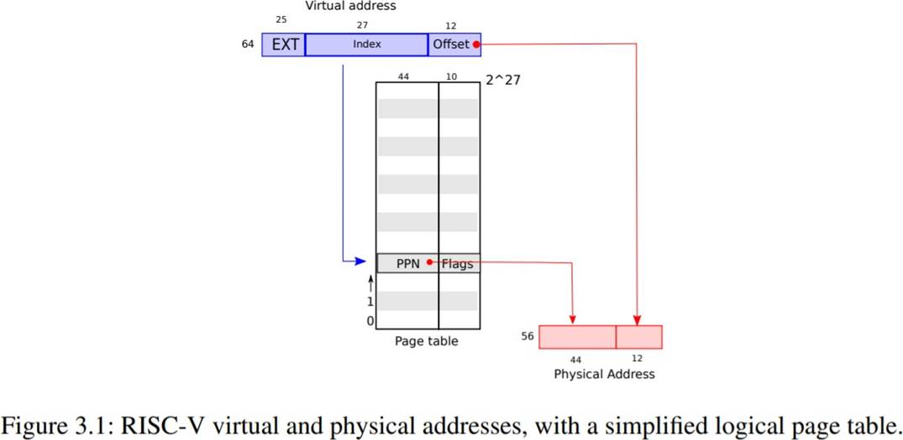
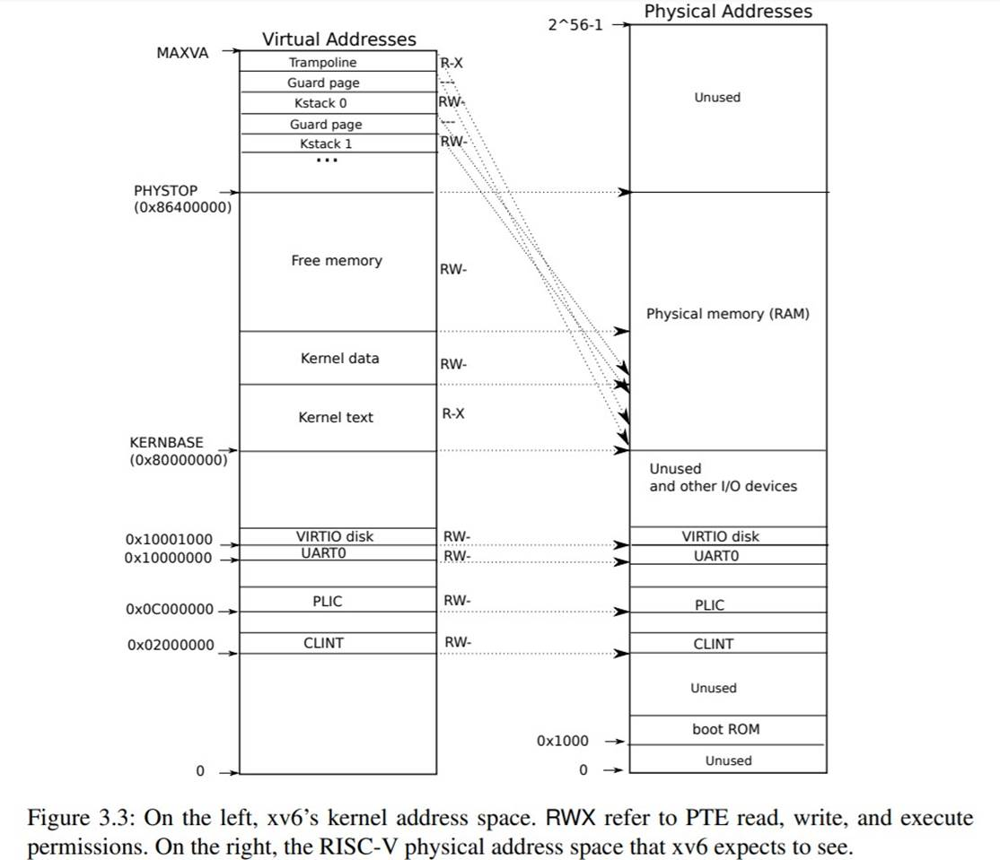
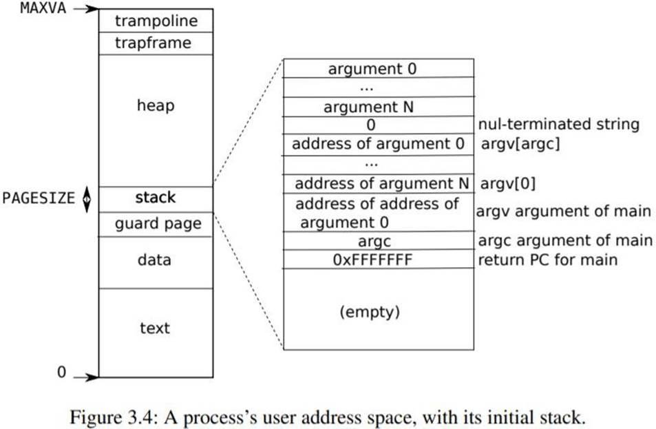

# 1 第三章：页表

通过页表机制，操作系统为每个进程提供各自私有的地址空间和内存。页表决定了内存地址的含义，以及物理内存的哪些部分可以被访问。它们允许 `xv6` 隔离不同进程的地址空间，并将它们映射到物理内存上。页表还提供了一个间接层次，允许 `xv6` 实现一些技巧：*在几个地址空间中映射同一内存（`trampoline` 页）*，以及用一个未映射页来保护内核栈和用户栈。本章其余部分将解释 `RISC-V` 硬件提供的页表以及 `xv6` 如何使用它们。

## 1.1 Paging hardwae

提醒一下，`RISC-V` 指令（包括用户和内核）*操作的是虚拟地址*。机器的 `RAM`，或者说物理内存，是用物理地址来做索引的。`RISC-V`的 **页表硬件** 通过*将每个虚拟地址映射到一个物理地址*将这两种地址联系起来。

`xv6`运行在`Sv39 RISC-V`上，这意味着*只会使用64位虚拟地址的低39位，高25位没有被使用*。在这种`Sv39`配置中，一个RISC-V页表在 *逻辑上* 是一个由2²⁷（134,217,728）个`页表项（Page Table Entry, PTE）`组成的数组。每个`PTE`包含一个44位的`物理页号（Physical Page Number, PPN）`和一些标志位。`分页硬件`通过利用*39位中的高27位索引*到页表中找到一个`PTE`来转换一个虚拟地址，并计算出一个56位的物理地址:
- 它的前44位来自于`PTE`中的`PPN`，而它的后12位则是从原来的虚拟地址复制过来的。

图3.1显示了这个过程，在逻辑上可以把页表看成是一个简单的`PTE`数组（更完整的描述见图3.2）。页表让操作系统控制虚拟地址到物理地址的转换，其*粒度为4096（2¹²）字节的对齐块*。这样的分块称为`页`。

在`Sv39 RISC-V`中，*虚拟地址的高25位不用于地址转换*；将来，`RISC-V`可能会使用这些位来定义更多的转换层。物理地址也有增长的空间：在`PTE`格式中，物理页号还有 10 位的增长空间。


 

如图 3.2 所示，实际上转换过程分三步进行。一个页表以三层树的形式存储在物理内存中:
-  *树的根部是一个 4096 字节的页表页*，它包含 512 个 `PTE`，这些 `PTE` 包含树的**下一级页表页的物理地址**。
- 每一页都包含 512 个 `PTE`，用于指向下一个页表或物理地址。
即 `分页硬件` 用 27 位中的高 9 位选择根页表页中的 PTE，用中间 9 位选择树中下一级页表页中的 PTE，用低 9 位选择最后的 PTE。


如果转换一个地址所需的三个 `PTE` 中的任何一个不存在，`分页硬件`就会引发一个**缺页异常（page-fault exception）**，让内核来处理这个异常（见第 4 章）。这种三层结构允许页表在处理大范围的虚拟地址没有被映射这种常见情况时，能够忽略整个页表。


每个 `PTE` 都包含标志位，用于*告诉`分页硬件`相关的虚拟地址被允许怎样使用*:
- `PTE_V` 表示 `PTE` 是否存在：如果没有设置，对该页的引用会引起异常（即不允许）。
- `PTE_R` 控制是否允许指令读取该页。
- `PTE_W` 控制是否允许指令向该页写入。
- `PTE_X` 控制 `CPU` 是否可以将页面的内容解释为指令并执行。
- `PTE_U` 控制是否允许用户态下的指令访问页面；如果不设置 `PTE_U`， 对应 `PTE` 只能在内核态下使用。

图 3.2 显示了这一切的工作原理。标志位和与分页硬件相关的数据结构定义在（`kernel/riscv.h`）中。


*要告诉硬件使用一个页表，内核必须将对应**根页表页的物理地址**写入 `satp` 寄存器中*。每个 `CPU` 都有自己的 `satp` 寄存器。一个 `CPU` 将使用自己的 `satp` 所指向的页表来翻译后续指令产生的所有地址。每个 `CPU` 都有自己的 `satp`，这样不同的 `CPU` 可以运行不同的进程，每个进程都有自己的页表所描述的私有地址空间。


关于术语的一些说明：
- `物理内存`:指的是 `DRAM` 中的存储单元。
- `物理地址`: 物理存储器的一个字节有一个地址，称为物理地址。当指令操作虚拟地址时，分页硬件会将其翻译成物理地址，然后发送给 `DRAM` 硬件，以读取或写入存储。
- `虚拟内存`: 不像物理内存和虚拟地址，虚拟内存不是一个物理对象，而是指内核提供的管理物理内存和虚拟地址的抽象和机制的集合。


### 1.1.1 Kernel address space


`Xv6` ==为每个进程维护一个用于描述进程的用户地址空间的页表，外加一个单独的描述内核地址空间的页表==。内核配置其地址空间的布局，使其能够通过可预测的虚拟地址访问物理内存和各种硬件资源。
图 3.3 显示了这个设计是如何将内核虚拟地址映射到物理地址的。

  

>文件（`kernel/memlayout.h`）声明了 `xv6` 内核内存布局的常量。


`QEMU` 模拟的计算机包含 `RAM`（ 物理内存），从物理地址 `0x80000000` 开始， 至少到 `0x86400000`，`xv6` 称之为 `PHYSTOP`。

`QEMU` 模拟还包括 `I/O` 设备，如磁盘接口。`QEMU` 将设备接口作为`内存映射（memory-mapped）`的控制寄存器暴露给软件，这些寄存器位于物理地址空间的 `0x80000000` 以下。内核可以通过读取/写入这些特殊的物理地址与设备进行交互；这种读取和写入与设备硬件而不是与 `RAM` 进行通信。第 4 章解释了 `xv6` 如何与设备交互。


内核对`RAM`和`内存映射的设备寄存器`使用 **“直接映射”**，也就是将这些资源映射到和它们物理地址相同的虚拟地址上。例如，内核本身在虚拟地址空间和物理内存中的位置都是`KERNBASE=0x80000000`。

`直接映射`简化了读/写物理内存的内核代码。例如，当 `fork` 为子进程分配用户内存时，分配器返回该内存的物理地址；`fork` 在将父进程的用户内存复制到子进程时，直接使用该地址作为虚拟地址。

有几个内核虚拟地址不是直接映射：

- `trampoline` 页。它被映射在虚拟地址空间的顶端；用户页表也有这个映射。第 4 章讨论了 `trampoline` 页的作用，但我们在这里看到了页表的一个有趣的用例: 
	 一个物理页（存放 `trampoline` 代码）在内核的虚拟地址空间中被映射了两次：一次是在虚拟地址空间的顶部，一次是直接映射。


- 内核栈页。*每个进程都有自己的内核栈，内核栈被映射到高地址处*，*所以 xv6 可以在它后面留下一个未映射的守护页*。守护页的 `PTE` 是无效的（不设置 `PTE_V` 位），这样如果内核栈溢出，很可能会引起异常，内核会报错。如果没有防护页，栈溢出时会覆盖其他内核内存，导致不正确的操作。报错还是比较好的。

内核通过高地址映射使用它的栈空间，栈空间也可以通过直接映射的地址被内核访问。另一种的设计是只使用直接映射，并在直接映射的地址上使用 `stack`。但是在这种安排中，提供保护页将涉及到取消映射虚拟地址，否则这些地址将指向物理内存，这将很难使用。

内核将 `trampoline` 和 `text`（可执行程序的代码段）映射为有 `PTE_R` 和 `PTE_X` 权限的页。内核从这些页读取和执行指令。内核映射的其他页会有 `PTE_R` 和 `PTE_W` 权限，以便内核读写这些页面的内存。守护页的映射是无效的（不设置 `PTE_V`）。 

### 1.1.2 Code: creating an address space


大部分用于操作地址空间和页表的 `xv6` 代码都在`vm.c`（`kernel/vm.c:1`）中。核心数据结构是 `pagetable_t`，它实际上是一个指向 `RISC-V` 根页表页的指针；`pagetable_t`可以是内核页表，也可以是进程的页表。核心函数是 `walk` 和 `mappages`，前者通过虚拟地址得到 `PTE`，后者将虚拟地址映射到物理地址。
- 以 `kvm` 开头的函数操作内核页表；
- 以 `uvm` 开头的函数操作用户页表；
- 其他函数同时用于这两种页表。
- `copyout`和`copyin`将数据复制到或复制出被作为系统调用参数的用户*虚拟地址*；它们在 `vm.c` 中，因为它们需要显式转换用户空间的地址，以便找到相应的物理内存。


在机器启动时，在启动序列的靠前部分，`main` 调用 `kvminit`（`kernel/vm.c:22`）来创建内核页表。这个调用发生在 `xv6` 在 `RISC-V` 启用分页之前，所以地址直接指向物理内存。
1. `kvminit` 首先分配一页物理内存来存放根页表页。
2. 然后调用 `kvmmap` 将内核所需要的硬件资源映射到物理地址。这些资源包括内核的指令和数据，`KERNBASE` 到 `PHYSTOP`的物理内存，以及实际上是设备的内存范围。`kvmmap`（`kernel/vm.c:118`）调用 `mappages`（`kernel/vm.c:149`），它将指定范围的虚拟地址映射到一段物理地址。它将范围内地址分割成多页（忽略余数），每次映射一页的起始地址。对于每个要映射的虚拟地址（页的起始地址），`mapages` 调用 `walk` 找到该地址的最后一级 PTE 的地址。然后，它配置 PTE，使其持有相关的物理页号、所需的权限（`PTE_W`、`PTE_X`和/或`PTE_R`），以及`PTE_V`来标记 PTE 为有效（`kernel/vm.c:161`）。


`walk`（`kernel/vm.c:72`）模仿 `RISC-V` 分页硬件查找虚拟地址的 `PTE`（见图 3.2）。`walk` 每次降低 9 位来查找三级页表。它使用每一级的 9 位虚拟地址来查找下一级页表或最后一级（`kernel/vm.c:78`）的 PTE。如果 PTE 无效，那么所需的物理页还没有被分配；如果 `alloc` 参数被设置，`walk` 会分配一个新的页表页，并把它的物理地址放在 PTE 中。它返回 树中最低层PTE的地址（`kernel/vm.c:88`）。

`main` 调用 `kvminithart`（`kernel/vm.c:53`）来映射内核页表。它将根页表页的物理地址写入寄存器 `satp` 中。在这之后，`CPU` 将使用内核页表翻译地址。由于内核使用唯一映射，所以指令的虚拟地址将映射到正确的物理内存地址。


`procinit`（`kernel/proc.c:26`），它由 `main` 调用，为每个进程分配一个内核栈。它将每个栈映射在 `KSTACK` 生成的虚拟地址上，这就为栈守护页留下了空间。`kvmmap` 将对应的`PTE`加入到内核页表中，然后调用 `kvminithart` 将内核页表重新加载到 `satp` 中，这样硬件就知道新的 `PTE` 了。

每个 `RISC-V` `CPU` 都会在 `translation look-aside buffer(tlb)` 中缓存页表项，==当 xv6 改变页表时，必须告诉 `CPU` 使相应的缓存 TLB 项无效==。如果它不这样做，那么在以后的某个时刻，TLB 可能会使用一个旧的缓存映射，指向一个物理页，而这个物理页在此期间已经分配给了另一个进程，这样的话，一个进程可能会在其他进程的内存上“乱写乱画“。`RISC-V` 有一条指令 `sfence.vma`，可以刷新当前 `CPU` 的 `TLB`。`xv6` 在`kvminithart`中，重新加载 `satp` 寄存器后， 执行 `sfence.vma`，也会在从内核空间返回用户空间前，切换到用户页表的`trampoline` 代码中执行 `sfence.vma`（`kernel/trampoline.S:79`）。


### 1.1.3 Physical memory allocation

 内核必须在运行时为页表、用户内存、内核堆栈和管道缓冲区分配和释放物理内存。xv6 使用内核地址结束到 `PHYSTOP` 之间的物理内存来进行运行时分配。它每次分配和释放整个4096 字节的页面。它通过保存空闲页链表，来记录哪些页是空闲的。分配包括从链表中删除一页；释放包括将释放的页面添加到空闲页链表中。


### 1.1.4 Code: Physical memory allocator


分配器在 `kalloc.c`（`kernel/kalloc.c:1`）中。分配器的数据结构是一个可供分配的物理内存页的**空闲链表**，每个空闲页的链表元素是一个结构体 `struct run`（`kernel/kalloc.c:17`）。分配器从哪里获得内存来存放这个结构体呢？它把每个空闲页的 `run` 结构体存储在空闲页自身里面，因为那里没有其他东西存储。空闲链表由一个**自旋锁**保护（`kernel/kalloc.c:21-24`）。链表和锁被包裹在一个结构体中，以明确锁保护的是结构体中的字段。现在，请忽略锁以及 `acquire` 和`release` 的调用；第 6 章将详细研究锁。


`main` 调用 `kinit` 来初始化分配器（`kernel/kalloc.c:27`）。`kinit` 初始化空闲页链表，以保存内核地址结束到 `PHYSTOP` 之间的每一页。
	`xv6` 应该通过解析硬件提供的配置信息来确定有多少物理内存可用。但是它没有这么做，而是假设机器有 `128M` 字节的 `RAM`。
`kinit` 通过调用`freerange` 来添加内存到空闲页链表，`freerange` 则对每一页都调用 `kfree`。`PTE` 只能指向按`4096` 字节对齐的物理地址（`4096` 的倍数），因此 `freerange` 使用 `PGROUNDUP` 来确保它只添加对齐的物理地址到空闲链表中。分配器开始时没有内存；这些对 `kfree` 的调用给了它一些内存管理。


分配器有时*把地址当作整数来处理，以便对其进行运算*（如 `freerange` 遍历所有页）， 有时把地址当作指针来读写内存（如操作存储在每页中的 `run` 结构体）；这种对地址的双重使用是分配器代码中充满 C 类型转换的主要原因。另一个原因是，释放和分配本质上改变了内存的类型。


`kfree`（`kernel/kalloc.c:47`）将被释放的内存中的每个字节设置为1。*这将使得释放内存后使用内存的代码（使用悬空引用）将会读取垃圾而不是旧的有效内容；希望这将导致这类代码更快地崩溃*。然后 `kfree` 将页面预存入释放列表：它将 `pa`（物理地址）转为指向结构体 `run` 的指针，在 `r->next` 中记录空闲链表之前的节点，并将释放列表设为 `r`。`kalloc`移除并返回空闲链表中的第一个元素。

### 1.1.5 Process address space


每个进程都有一个单独的页表，当 `xv6` 在进程间切换时，也会改变页表。如图 2.3 所示，一个进程的用户内存从虚拟地址 0 开始，可以增长到 `MAXVA`（`kernel/riscv.h:348`），原则上允许一个进程寻址 `256GB` 的内存。

当一个进程要求 `xv6` 提供更多的用户内存时，`xv6` 首先使用 `kalloc` 来分配物理页，然后将指向新物理页的 `PTE` 添加到进程的页表中。`Xv6` 设置这些 `PTE` 的 `PTE_W`、`PTE_X`、`PTE_R`、`PTE_U` 和 `PTE_V` 标志。大多数进程不使用整个用户地址空间；*xv6 将不使用的 PTE 的 `PTE_V` 位保持为清除状态*。

我们在这里看到了几个有趣例子，是关于使用页表的。首先，不同的进程页表将用户地址转化为物理内存的不同页，这样每个进程都有私有的用户内存。第二，每个进程都认为自己的内存具有从零开始的连续的虚拟地址，而进程的物理内存可以是不连续的。第三，内核会映射带有 `trampoline` 代码的页到用户地址空间顶端，因此，有一物理内存页在所有地址空间中都会出。





图 3.4 更详细地显示了 `xv6` 中执行进程的用户内存布局。*栈只有一页*，图中显示的是由`exec` 创建的初始内容。位于栈顶部的字符串中包含了*命令行中输入的参数*和*指向他们的指针数组*。在下方是允许程序在 `main` 启动的值，就像函数 `main(argc, argv)` 是刚刚被调用一样。


为了检测用户栈溢出分配的栈内存，`xv6` 会在 `stack` 的下方放置一个无效的保护页。如果用户栈溢出，而进程试图使用栈下面的地址，硬件会因为该映射无效而产生一个缺页异常。一个现实世界中的操作系统可能会在用户栈溢出时自动为其分配更多的内存。

### 1.1.6 Code: sbrk

 `sbrk` 是 一 个 进 程 收 缩 或 增 长 内 存 的 系 统 调 用 。 该 系 统 调 用 由 函 数`growproc`（`kernel/proc.c:239`）实现，`growproc` 调用 `uvmalloc` 或 `uvmdealloc`，取决于 `n` 是正数还是负数。`uvmalloc`（`kernel/vm.c:229`）通过 `kalloc` 分配物理内存，并使用 `mappages` 将 PTE 添加到用户页表中。 `uvmdealloc` 调用 `uvmunmap`（`kernel/vm.c:174`），它使用 `walk` 来查找 PTE 并使用 `kfree` 来释放它们所引用的物理内存。

xv6 使用进程的页表不仅是为了告诉硬件如何映射用户虚拟地址，也是将其作为分配给该进程的物理地址的唯一记录。这就是为什么释放用户内存（`uvmunmap` 中）需要检查用户页表的原因。

### 1.1.7 Code: exec

`exec` 是创建一个地址空间的用户部分的系统调用。它读取储存在文件系统上的文件用来初始化一个地址空间的用户部分。`exec`（`kernel/exec.c:13`）使用 `namei`（`kernel/exec.c:26`）打开二进制文件路径，这在第 8 章中有解释。然后，它读取 `ELF` 头。`xv6` 应用程序用 `ELF` 格式来描述可执行文件，它定义在（`kernel/elf.h`）。一个 `ELF` 二进制文件包括一个 `ELF` 头，`struct elfhdr`（`kernel/elf.h:6`）。之后是一串程序段头（program section header），`struct proghdr`（`kernel/elf.h:25`）。每一个`proghdr`描述了应用的一个必须加载到内存中的程序段；`xv6` 程序只有一个程序段头，但其他系统可能有分开的指令段和数据段需要加载到内存。


第一步是快速检查文件是否是ELF格式。一个 ELF 二进制文件以四个字节的“魔法数字” `0x7F`、`E`、`L`、`F`或 `ELF_MAGIC`（`kernel/elf.h:3`）开始。如果 ELF 头有正确的”魔法数字“，`exec`就会认为该二进制文件是正确的类型。

`exec`使用`proc_pagetable`（`kernel/exec.c:38`）分配一个没有使用的页表，使用 `uvmalloc`（`kernel/exec.c:52`）为每一个 ELF 段分配内存，使用 `loadseg`（`kernel/exec.c:10`）加载每一个段到内存中。`loadseg`使用`walkaddr`找到分配内存的物理地址，在该地址写入 ELF 段的每一页，页的内容通过 `readi` 从文件中读取。

用 `exec` 创建的第一个用户程序`/init` 的程序段头是这样的：

```sh
# objdump -p _init
user/_init: file format elf64-littleriscv
Program Header:
	LOAD off 	0x00000000000000b0 vaddr 0x0000000000000000
    							   paddr 0x0000000000000000 align 2**3
    	 filesz 0x0000000000000840 memsz 0x0000000000000858 flags rwx
   STACK off 	0x0000000000000000 vaddr 0x0000000000000000
    						 	   paddr 0x0000000000000000 align 2**4
    	 filesz 0x0000000000000000 memsz 0x0000000000000000 flags rw-
```

程序段头的 `filesz` 可能小于 `memsz`，说明它们之间的空隙应该用 0来填充（对于 C 语言中的全局变量），而不是从文件中读取。对于`/init`来说，`filesz`是 2112 字节，`memsz`是 2136字节，因此 `uvmalloc` 分配了足够的物理内存来容纳 2136 字节，但只从文件`/init` 中读取 2112字节。

`exec` 在栈页的下方放置了一个不可访问页，这样程序如果试图使用多个页面，就会出现故障。这个不可访问的页还能允许`exec` 处理过大的参数；在这种情况下，`exec`用来复制参数到栈的 `copyout`（`kernel/vm.c:355`）函数会注意到目标页不可访问，并返回-1。

在准备新的内存映像的过程中，如果 `exec` 检测到一个错误，比如一个无效的程序段， 它就会跳转到标签 `bad`，释放新的映像，并返回-1。`exec` 必须延迟释放旧映像，直到它确定`exec`系统调用会成功：如果旧映像消失了，系统调用就不能返回-1。`exec`中唯一的错误情况发生在创建映像的过程中。一旦镜像完成，`exec`就可以提交到新的页表（`kernel/exec.c:113`）并释放旧的页表（`kernel/exec.c:117`）。

`exec` 将 ELF 文件中的字节按 ELF 文件指定的地址加载到内存中。用户或进程可以将任何他们想要的地址放入 ELF 文件中。因此，`exec`是有风险的，因为 ELF 文件中的地址可能会意外地或故意地指向内核。对于一个不小心的内核来说，后果可能从崩溃到恶意颠覆内核的隔离机制(即安全漏洞)。xv6 执行了一些检查来避免这些风险。例如 `if (ph.vaddr + ph.memsz < ph.vaddr)`检查总和是否溢出一个 64 位整数。危险的是，用户可以用指向用户选择的地址的 `ph.vaddr` 和足够大的 `ph.memsz` 来构造一个 ELF 二进制，使总和溢出到 **0x1000**，这看起来像是一个有效值。在旧版本的 xv6 中，用户地址空间也包含内核（但在用户模式下不可读/写），用户可以选择一个对应内核内存的地址，从而将 ELF 二进制中的数据复制到内核中。在 RISC-V 版本的 xv6 中，这是不可能的，因为内核有自己独立的页表；`loadseg`加载数据到进程的页表中，而不是内核的页表中。

内核开发人员很容易忽略一个关键的检查，现实中的内核有很长一段缺少检查的空档期， 用户程序可以利用缺少这些检查来获得内核特权。xv6 在验证需要提供给内核的用户程序数据的时候，并没有完全验证其是否是恶意的，恶意用户程序可能利用这些数据来绕过 xv6 的隔离。


### 1.1.8 Real world


像大多数操作系统一样，xv6 使用分页硬件进行内存保护和映射。大多数操作系统对分页的使用要比 xv6 复杂得多，它将分页和缺页异常结合起来，我们将在第 4 章中讨论。

Xv6 的内核使用虚拟地址和物理地址之间的直接映射，这样会更简单，并假设在地址0x8000000 处有物理 RAM，即内核期望加载的地方。这在 QEMU 中是可行的，但是在真实的硬件上，它被证明是一个糟糕的想法；真实的硬件将 RAM 和设备放置在不可预测的物理地址上，例如在 0x8000000 处可能没有 RAM，而 xv6 期望能够在那里存储内核。更好的内核设计利用页表将任意的硬件物理内存布局变成可预测的内核虚拟地址布局。

RISC-V 支持物理地址级别的保护，但 xv6 没有使用该功能。

在有大量内存的机器上，使用 RISC-V 对超级页(4MB 的页)的支持可能是有意义的。当物理内存很小的时候，小页是有意义的，可以对磁盘进行精细地分配和分页。例如，如果一个程序只使用 8 千字节的内存，那么给它整整 4 兆字节的超级物理内存页是浪费的。更大的页在有大量内存的机器上是有意义的，可以减少页表操作的开销。

xv6 内核缺乏一个类 malloc 的分配器为小程序提供内存，这使得内核没有使用需要动态分配的复杂数据结构，从而简化了设计。

内存分配是一个常年的热门话题，基本问题是有效利用有限的内存和为未来未知的请求做准备[[2]](#ftn2)。如今人们更关心的是速度而不是空间效率。此外，一个更复杂的内核可能会分配许多不同大小的小块，而不是（在 xv6 中）只分配 4096 字节的块；一个真正的内核分配器需要处理小块分配以及大块分配。


### 1.1.9 Exercises

1、分析 RISC-V 的设备树（device tree），找出计算机有多少物理内存。

2、编写一个用户程序，通过调用`sbrk(1)`使其地址空间增加一个字节。运行该程序，研究调用 `sbrk` 之前和调用`sbrk` 之后的程序页表。内核分配了多少空间？新内存的 PTE 包含哪些内容？

3、修改 xv6 使得内核使用超级页 4M。

4、修改 xv6，使用户程序间接引用一个空指针时，会收到一个异常，即修改 xv6，使用户程序的虚拟地址 0 不被映射。

5、Unix 实现的 exec 传统上包括对 shell 脚本的特殊处理。如果要执行的文件以文本`#!`开头， 那么第一行就被认为是要运行的程序来解释文件。例如，如果调用 `exec` 运行 `myprog arg1`， 而 `myprog` 的第一行是`#!/interp`，那么`exec` 执行`/interp myprog arg1`。在 xv6 中实现对这个约定的支持。

6、为内核实现地址空间的随机化。

 

 

 

 

 

 

 

 

 

 

 

 

 

 

 

 

 

 

 

 

 

 


------

1. <a name="ftn1"></a>即在栈中保存了从main返回所需要的信息
7. <a name="ftn2"></a>dereference，就是对地址取值，例如*p。