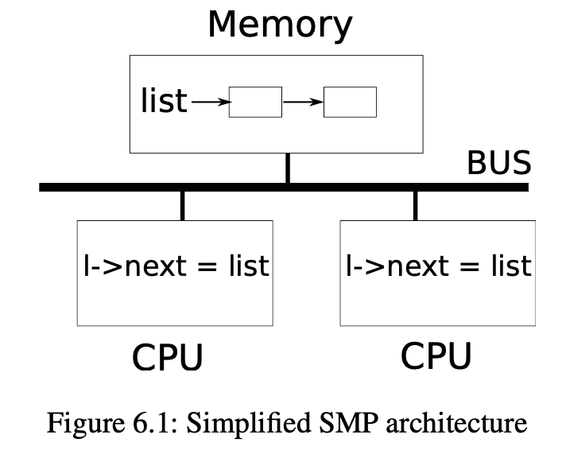
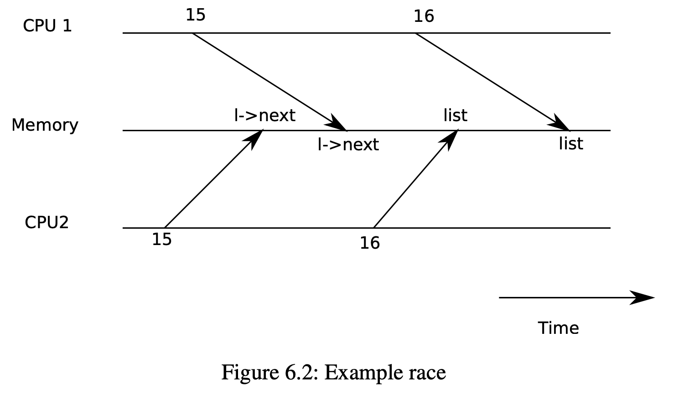
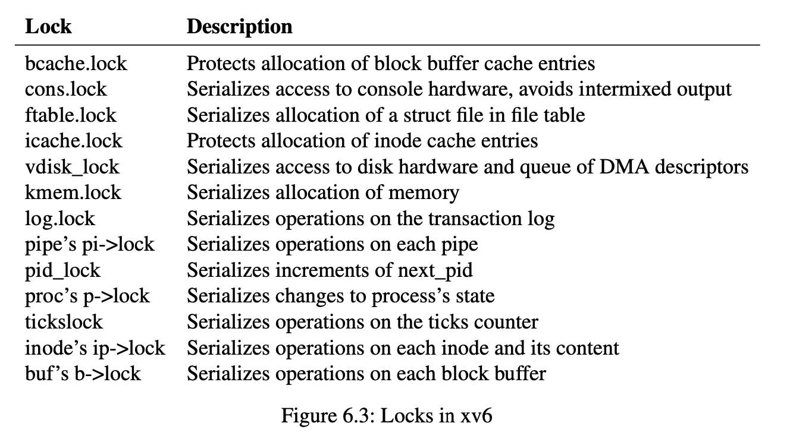

## 0.1 第六章：锁

大多数内核，包括xv6，都会交错执行多个任务。一种实现交错执行任务的方式是多处理器架构：硬件系统具有多个CPU独立执行，如xv6的RISC-V。这些CPU共享物理RAM，xv6利用共享来维护所有CPU读写的数据结构。这种共享带来了一种可能性，即一个CPU读取一个数据结构，而另一个CPU正在中途更新它，甚至多个CPU同时更新同一个数据。如果不仔细设计，这种并行访问很可能产生不正确的结果或破坏数据结构。即使在单处理器上，内核也可能在多个线程之间切换CPU，导致它们的执行交错。最后，如果中断发生的时间不对，一个设备中断处理程序可能会修改与一些可中断代码相同的数据，从而破坏数据。并发一词指的是由于多处理器并行、线程切换或中断而导致多个指令流交错的情况。

内核中充满了并发访问的数据。例如，两个CPU可以同时调用`kalloc`，从而并发地从空闲内存链表的头部push。内核设计者喜欢允许大量的并发，因为它可以通过并行来提高性能，提高响应速度。然而，结果是内核设计者花了很多精力来让自己确认这些存在的并发是正确的。有很多方法可以写出正确的代码，有些方法比其他方法更简单。以并发下的正确性为目标的策略，以及支持这些策略的抽象，被称为并发控制技术。

根据不同的情况，xv6使用了很多并发控制技术，且还有更多的可能尚未被实现。本章重点介绍一种广泛使用的技术:锁（lock）。锁提供了互斥的功能，确保一次只有一个CPU可以持有一个特定的锁。如果程序员为每个共享数据项关联一个锁，并且代码在使用某项时总是持有关联的锁，那么该项每次只能由一个CPU使用。在这种情况下，我们说锁保护了数据项。虽然锁是一种简单易懂的并发控制机制，但其也带来了性能降低的缺点，因为锁将并发操作串行化了。

本章的其余部分解释了为什么xv6需要锁、xv6如何实现它们以及如何使用它们。

### 0.1.1 竞争条件



作为我们为什么需要锁的一个例子，考虑两个进程在两个不同的CPU上调用`wait`，`wait`释放子进程的内存。因此，在每个CPU上，内核都会调用`kfree`来释放子进程的内存页。内核分配器维护了一个链表:`kalloc()`(kernel/kalloc.c:69)从空闲页链表中pop一页内存，`kfree()`(kernel/kalloc.c:47)将一页push空闲链表中。为了达到最好的性能，我们可能希望两个父进程的`kfree`能够并行执行，而不需要任何一个进程等待另一个进程，但是考虑到xv6的`kfree`实现，这是不正确的。

图6.1更详细地说明了这种设置：链表在两个CPU共享的内存中，CPU使用加载和存储指令操作链表。(在现实中，处理器有缓存，但在概念上，多处理器系统的行为就像有一个单一的共享内存一样)。如果没有并发请求，你可能会实现如下的链表push操作:

```c
struct element{
	int data;
	struct element *next;
};

struct element *list = 0;

void
push(int data)
{
	struct element *l;

	l = malloc(sizeof *l);
    l->data = data;
    l->next = list;
	list = l;
}
```



如果单独执行，这个实现是正确的。但是，如果多个副本同时执行，代码就不正确。如果两个CPU同时执行`push`，那么两个CPU可能都会执行图6.1所示的第15行，然后其中一个才执行第16行，这就会产生一个不正确的结果，如图6.2所示。这样就会出现两个list元素，将next设为list的前值。当对list的两次赋值发生在第16行时，第二次赋值将覆盖第一次赋值;第一次赋值中涉及的元素将丢失。

第16行的丢失更新是竞争条件(race condition)的一个例子。竞争条件是指同时访问一个内存位置，并且至少有一次访问是写的情况。竞争通常是一个错误的标志，要么是丢失更新(如果访问是写)，要么是读取一个不完全更新的数据结构。竞争的结果取决于所涉及的两个CPU的确切时间，以及它们的内存操作如何被内存系统排序，这可能会使竞争引起的错误难以重现和调试。例如，在调试`push`时加入`print`语句可能会改变执行的时机，足以使竞争消失。

避免竞争的通常方法是使用锁。锁确保了相互排斥，因此一次只能有一个CPU执行`push`的哪一行;这就使得上面的情况不可能发生。上面代码的正确`lock`版本只增加了几行代码。

```c
struct element *list=0;
struct locklist lock;

void
push (int data)
{
	struct element *l;

	l = malloc(sizeof *l);
    l->data = data;
	acquire(&listlock);
    l->next = list;
	list = l;
    release(&listlock);
}
```

`acquire`和`release`之间的指令序列通常被称为临界区。这里的锁保护`list`。

当我们说锁保护数据时，我们真正的意思是**锁保护了一些适用于数据的不变量(invariant)的集合**。不变量是数据结构的属性，这些属性在不同的操作中得到维护。通常情况下，一个操作的正确行为取决于操作开始时的不变量是否为真。操作可能会暂时违反不变量，但在结束前必须重新建立不变量。例如，在链表中，不变性是：“list指向列表中的第一个元素，并且每个元素的下一个字段指向下一个元素”。push的实现暂时违反了这一不变性：在第17行，l指向下一个链表元素list，但list还没有指向l（在第18行重新建立）。我们上面所研究的竞争条件之所以会发生，是因为第二个CPU执行了依赖于列表不变式的代码，而它们被（暂时）违反了。正确使用锁可以确保每次只有一个CPU可以对关键部分的数据结构进行操作，因此当数据结构的不变式不成立时，没有CPU会执行数据结构操作。

你可以把锁看成是把并发的关键部分序列化，使它们一次只运行一个，从而保存不变性（假设关键部分孤立地正确）。你也可以认为由同一个锁保护的关键部分是相互原子的(atomic)，因此每个关键部分只看到来自更早的关键部分的完整变化，而永远不会看到部分完成的更新。

虽然正确使用锁可以使不正确的代码变得正确，但锁限制了性能。例如，如果两个进程同时调用kfree，锁会将两个调用序列化，我们在不同的CPU上运行它们不会获得任何好处。我们说，如果多个进程同时想要同一个锁，就会发生冲突，或者说锁经历了争夺。内核设计的一个主要挑战是避免锁的争夺。Xv6在这方面做得很少，但是复杂的内核会专门组织数据结构和算法来避免锁争用。在列表的例子中，一个内核可能会维护每个CPU的空闲列表，只有当CPU的列表是空的，并且它必须从另一个CPU偷取内存时，才会接触另一个CPU的空闲列表。其他用例可能需要更复杂的设计。

锁的位置对性能也很重要。例如，在`push`中把`acquisition`移动到较早的位置也是正确的：将`acquisition`的调用移动到第13行之前是可以的。然而，这可能会降低性能，因为这样的话，对`malloc`的调用也会被序列化。下面的“使用锁”一节提供了一些关于在哪里插入`acquisition`和`release`调用的指南。

### 0.1.2 代码：锁
Xv6有两种类型的锁:自旋锁(`spinlock`)和睡眠锁(`sleeplock`)。我们先说说自旋锁。Xv6将自旋锁表示为一个结构体`spinlock`(kernel/spinlock.h:2)。该结构中重要的字段是`locked`，当锁可获得时，`locked`为零，当锁被持有时，`locked`为非零。从逻辑上讲，xv6获取锁的的代码类似于:

```c
void
acquire(struct spinlock *lk)//doesnotwork!
{
	for(;;){
		if(lk->locked == 0){
			lk->locked = 1;
			break;
		}
	}
}
```

不幸的是，这种实现并不能保证多处理器上的相互排斥。可能会出现这样的情况:两个CPU同时到达if语句，看到`lk->locked`为零，然后都通过设置`lk->locked=1`来抢夺锁。此时，两个不同的CPU持有锁，这就违反了互斥属性。我们需要的是让第25行和第26行作为一个原子(即不可分割)步骤来执行。

由于锁被广泛使用，多核处理器通常提供了一些原子版的指令。在RISC-V上，这条指令是`amoswapr,a`。`amoswap`读取内存地址`a`处的值，将寄存器`r`的内容写入该地址，并将其读取的值放入`r`中，也就是说，它将寄存器的内容和内存地址进行了交换。它原子地执行这个序列，使用特殊的硬件来防止任何其他CPU使用读和写之间的内存地址。

Xv6的`acquire`(kernel/spinlock.c:22使用了可移植的C库调用`__sync_lock_test_and_set`，它本质上为`amoswap`指令;返回值是`lk->locked`的旧(被交换出来的)内容。`acquire`函数循环交换，重试(旋转)直到获取了锁。每一次迭代都会将1交换到`lk->locked`中，并检查之前的值;如果之前的值为0，那么我们已经获得了锁，并且交换将`lk->locked`设置为1。如果之前的值是1，那么其他CPU持有该锁，而我们原子地将1换成`lk->locked`并没有改变它的值。

一旦锁被获取，`acquire`就会记录获取该锁的CPU，这方便调试。`lk->cpu`字段受到锁的保护，只有在持有锁的时候才能改变。

函数`release`(kernel/spinlock.c:47)与`acquire`相反:它清除`lk->cpu`字段，然后释放锁。从概念上讲，释放只需要给`lk->locked`赋值为0。C标准允许编译器用多条存储指令来实现赋值，所以C赋值对于并发代码来说可能是非原子性的。相反，`release`使用C库函数`__sync_lock_release`执行原子赋值。这个函数也是使用了RISC-V的`amoswap`指令。

### 0.1.3 代码：使用锁
Xv6在很多地方使用锁来避免竞赛条件。如上所述，`kalloc`(kernel/kalloc.c:69)和`kfree`(kernel/kalloc.c:47)就是一个很好的例子。试着练习1和2看看如果这些函数省略了锁会发生什么事情。你可能会发现，很难触发不正确的行为，这说明很难可靠地测试代码是否没有锁定错误和竞争。xv6有一些竞争也不是不可能的。

使用锁的一个难点是决定使用多少个锁，以及每个锁应该保护哪些数据和不变量。有几个基本原则。首先，任何时候，当一个CPU可以在另一个CPU读或写变量的同时写入变量时，都应该使用锁来防止这两个操作重叠。第二，记住锁保护不变量：如果一个不变量涉及多个内存位置，通常需要用一个锁保护所有的位置，以确保不变式得到维护。

上面的规则说了什么时候需要锁，但没有说什么时候不需要锁，为了效率，不要锁太多，因为锁会降低并行性。如果并行性不重要，那么可以安排只有一个进程，而不用担心锁的问题。一个简单的内核可以在多处理器上做到这一点，它有一个单一的锁，这个锁必须在进入内核时获得，并在退出内核时释放（尽管系统调用，如管道读取或等待会带来一个问题）。许多单处理器操作系统已经被改造成使用这种方法在多处理器上运行，有时被称为"大内核锁"，但这种方法牺牲了并行性：内核中一次只能执行一个CPU。如果内核做任何繁重的计算，那么使用一组更大的更细粒度的锁，这样内核可以同时在多个CPU上执行，效率会更高。

作为粗粒度锁的一个例子，xv6的kalloc.c分配器有一个单一的空闲列表，由一个单一的锁构成。如果不同CPU上的多个进程试图同时分配页面，那么每个进程都必须通过在`acquire`中旋转来等待轮到自己。旋转会降低性能，因为这不是有用的工作。如果争夺锁浪费了相当一部分CPU时间，也许可以通过改变分配器的设计来提高性能，使其拥有多个空闲列表，每个列表都有自己的锁，从而实现真正的并行分配。（该分配器在lockinglab中会被重写——译者注）

作为细粒度锁的一个例子，xv6为每个文件都有一个单独的锁，这样操作不同文件的进程往往可以不用等待对方的锁就可以进行。如果想让进程模拟写入同一文件的不同区域，文件锁方案可以做得更细。最终，锁的粒度决定需要由性能测量以及复杂性考虑来驱动。
在后续的章节解释xv6的每个部分时，会提到xv6使用锁来处理并发性的例子。作为预览，图6.3列出了xv6中所有的锁。



### 0.1.4 死锁和锁的顺序
如果一个穿过内核的代码路径必须同时持有多个锁，那么所有的代码路径以相同的顺序获取这些锁是很重要的。如果他们不这样做，就会有死锁的风险。假设线程T1执行代码path1并获取锁A，线程T2执行代码path2并获取锁B，接下来T1会尝试获取锁B，T2会尝试获取锁A，这两次获取都会无限期地阻塞，因为在这两种情况下，另一个线程都持有所需的锁，并且不会释放它，直到它的获取返回。为了避免这样的死锁，所有的代码路径必须以相同的顺序获取锁。对全局锁获取顺序的需求意味着锁实际上是每个函数规范的一部分:调用者调用函数的方式必须使锁按照约定的顺序被获取。

由于sleep的工作方式(见第7章)，xv6有许多长度为2的锁序链，涉及到进程锁(`structproc`中的锁)。例如，`consoleintr`(kernel/console.c:138)是处理格式化字符的中断流程。当一个新数据到达时，任何正在等待控制台（终端，即cmd）输入的进程都应该被唤醒。为此，`consoleintr`在调用`wakeup`时持有`cons.lock`，以获取进程锁来唤醒它。因此，全局避免死锁的锁顺序包括了`cons.lock`必须在任何进程锁之前获取的规则。文件系统代码包含xv6最长的锁链。例如，创建一个文件需要同时持有目录的锁、新文件的inode的锁、磁盘块缓冲区的锁、磁盘驱动器的`vdisk_lock`和调用进程的`p->lock`。为了避免死锁，文件系统代码总是按照上一句提到的顺序获取锁。

遵守全局避免死锁的顺序可能会非常困难。有时锁的顺序与逻辑程序结构相冲突，例如，也许代码模块M1调用模块M2，但锁的顺序要求M2中的锁在M1中的锁之前被获取。有时锁的身份并不是事先知道的，也许是因为必须持有一个锁才能发现接下来要获取的锁的身份。这种情况出现在文件系统中，因为它在路径名中查找连续的组件，也出现在`wait`和`exit`的代码中，因为它们搜索进程表寻找子进程。最后，死锁的危险往往制约着人们对锁方案的细化程度，因为更多的锁往往意味着更多的死锁机会。避免死锁是内核实现的重要需求。

### 0.1.5 锁与中断处理

一些`xv6`自旋锁保护的数据会被*线程和中断处理程序两者使用*。例如，`clockintr`定时器中断处理程序可能会在内核线程读取`sys_sleep`(kernel/sysproc.c:64)中的`ticks`的同时，递增`ticks`(kernel/trap.c:163)。锁`tickslock`将保护两次临界区。


自旋锁和中断的相互作用带来了一个潜在的危险。假设`sys_sleep`持有`tickslock`，而它的CPU接收到一个时钟中断。`clockintr`会尝试获取`tickslock`，看到它被持有，并等待它被释放。在这种情况下，`tickslock`永远不会被释放：只有`sys_sleep`可以释放它，但`sys_sleep`不会继续运行，直到`clockintr`返回。所以CPU会死锁，任何需要其他锁的代码也会冻结。


为了避免这种情况，*如果一个中断处理程序使用了自旋锁，CPU决不能在启用中断的情况下持有该锁*。*Xv6则采用了更加保守的策略：当一个CPU获取任何锁时，xv6总是禁用该CPU上的中断*。中断仍然可能发生在其他CPU上，所以一个中断程序获取锁会等待一个线程释放自旋锁，但它们不在同一个CPU上。

*`xv6`在`CPU`没有持有自旋锁时重新启用中断*;它必须做一点记录来应对嵌套的临界区。`acquire`调用`push_off`(kernel/spinlock.c:89)和`release`调用`pop_off`(kernel/spinlock.c:100)来跟踪当前CPU上锁的嵌套级别。当该计数达到零时，`pop_off`会恢复最外层临界区开始时的中断启用状态。`intr_off`和`intr_on`函数分别执行RISC-V指令来禁用和启用中断。

在设置`lk->locked`之前，严格调用`push_off`是很重要的(kernel/spinlock.c:28)。如果两者反过来，那么在启用中断的情况下，锁会有一个窗口(未锁到的位置)，在未禁止中断时持有锁。在这种情况下，一个时机恰到好处的时钟中断会使系统死锁。同样，释放锁后才调用`pop_off`也很重要(kernel/spinlock.c:66)。

### 0.1.6 指令与存储的顺序
人们很自然地认为程序是按照源代码语句出现的顺序来执行的。然而，许多编译器和`CPU`为了获得更高的性能，会不按顺序执行代码。如果一条指令需要很多周期才能完成，`CPU`可能会提前发出该指令，以便与其他指令重叠，避免`CPU`停顿。例如，`CPU`可能会注意到在一个串行序列中，*指令A和B互不依赖。CPU可能先启动指令B*，这是因为它的输入在A的输入之前已经准备好了，或者是为了使A和B的执行重叠。编译器可以执行类似的重新排序，在一条语句的指令之前发出另一条语句的指令，由于它们原来的顺序。

编译器和`CPU`在对指令重新排序时遵循相应规则，以确保它们不会改变正确编写的串行代码的结果。然而，这些规则确实允许重排，从而改变并发代码的结果，并且很容易导致多处理器上的不正确行为。*CPU的指令排序规则规则称为内存模型*(`memory model`)。

例如，在这段`push`的代码中，如果编译器或CPU将第4行对应的存储移到第6行释放后的某个点，那将是一场灾难。

```c
l = malloc(sizeof *l);
l->data = data;
acquire(&listlock);
l->next = list;
list = l;
release(&listlock);
```

如果发生这样的重排，就会有一个指令执行的窗口。在这个窗口中，另一个CPU可以获取锁并观察更新的链表，但看到的是一个未初始化的`list->next`。

为了告诉硬件和编译器不要执行这样的`re-ordering`，xv6在`acquire`(`kernel/spinlock.c:22`)和`release`(`kernel/spinlock.c:47`)中都使用了`__sync_synchronize()`。`__sync_synchronize`()是一个*内存屏障*(`memory barrier`):它告诉编译器和CPU不要在越过屏障重新排列任何的内存读写操作。`acquire`和`release`中的屏障几乎在所有重要的情况下都会强制锁定顺序，因为`xv6`在访问共享数据的周围使用锁。第9章讨论了一些例外情况。

### 0.1.7 睡眠锁

有时xv6需要长时间保持一个锁。例如，文件系统（第8章）在磁盘上读写文件内容时，会保持一个文件的锁定，这些磁盘操作可能需要几十毫秒。如果另一个进程想获取一个自旋锁，那么保持那么长的时间会导致浪费，因为第二个进程在等待锁的同时会浪费CPU很长时间。自旋锁的另一个缺点是，一个进程在保留自旋锁的同时不能释放CPU并将自身转变为就绪态；我们希望做到这一点，以便在拥有自旋锁的进程等待磁盘时，其他进程可以使用CPU。在持有自旋锁时释放CPU是非法的，因为如果第二个线程再试图获取自旋锁，可能会导致死锁；由于`acquire`并不能释放CPU，第二个进程的等待可能会阻止第一个进程运行和释放锁。在持有锁的同时释放CPU也会违反在持有自旋锁时中断必须关闭的要求。因此，我们希望有一种锁，在等待获取的同时让CPU可以进行别的工作，并在锁被持有时允许释放CPU，同时开放中断。

Xv6以睡眠锁(sleeplock)的形式提供了这样的锁。`acquiresleep`(kernel/sleeplock.c:22)在等待时产生`CPU`，使用的技术将在第7章解释。在高层次上，睡眠锁有一个由`spinlock`保护的锁定字段，`acquiresleep`调用`sleep`原子性地让渡CPU并释放`spinlock`。结果就是，在`acquireleep`等待的时候，其他线程可以执行。

*因为睡眠锁使中断处于启用状态，所以它们不能用于中断处理程序中*。由于`acquiresleep`可能会释放CPU，所以睡眠锁不能在自旋锁的核心代码中使用（尽管自旋锁可以在睡眠锁的核心代码中使用）。

自旋锁最适合于短的关键部分，因为等待它们会浪费CPU时间；睡眠锁对长的操作很有效。

### 0.1.8 现实世界

尽管对并发基元和并行进行了多年的研究，但使用锁进行编程仍然具有挑战性。通常最好是将锁隐藏在更高级别的构造中，比如同步队列，尽管xv6没有这样做。如果您使用锁编程，明智的做法是使用一个试图识别竞争条件的工具，因为很容易错过一个需要锁的不变式。

大多数操作系统都支持`POSIX`线程`（Pthreads`），它允许一个用户进程在不同的CPU上有多个线程同时运行。Pthreads对用户级锁、屏障等都有支持。支持`Pthreads`需要操作系统的支持。例如，应该是如果一个pthread在系统调用中阻塞，同一进程的另一个`pthread`应该可以在该CPU上运行。又比如，如果一个`pthread`改变了它的进程的地址空间（比如映射或取消映射内存），内核必须安排运行同一进程线程的其他`CPU`更新它们的硬件页表以反映地址空间的变化。

可以在没有原子指令的情况下实现锁，但成本很高，大多数操作系统都使用原子指令。

如果许多CPU试图同时获取同一个锁，那么锁的成本会很高。如果一个CPU的本地缓存中有一个锁，而另一个CPU必须获取该锁，那么更新持有该锁的缓存行的原子指令必须将该行从一个CPU的缓存中移到另一个CPU的缓存中，并且可能使缓存行的任何其他副本无效。从另一个CPU的缓存中获取缓存单元的代价可能比从本地缓存中获取行的代价高出一个数量级。

为了避免与锁相关的代价，许多操作系统使用无锁数据结构和算法。例如，可以实现像本章开头那样的链接列表，在列表搜索过程中不需要锁，只需要一条原子指令就可以在列表中插入一个项目。不过，无锁编程比有锁编程更复杂，例如，必须担心指令和内存的重新排序问题。用锁编程已经很难了，所以xv6避免了无锁编程的额外复杂性。

### 0.1.9 习题
1. 删去`kalloc`(kernel/kalloc.c:69)中对acquire和release的调用。这似乎会给调用kalloc的内核代码带来问题。你觉得会发生什么？当你运行xv6时，和你想的一样吗？运行`usertests`的时候呢？如果你没有看到问题，为什么没有呢？看看你是否可以通过在kalloc的关键部分插入dummy loops来引发问题。
2. 假设你在`kfree`中注释了锁(在恢复`kalloc`的锁之后)。现在可能出了什么问题？`kfree`中缺少锁是否比kalloc中缺少锁的危害小？
3. 如果两个CPU同时调用`kalloc`，其中一个就要等待另一个，这对性能不利。修改`kalloc.c`，使其具有更多的并行性，这样不同CPU对`kalloc`的同时调用就可以进行，而不需要等待对方。
4. 使用大多数操作系统都支持的POSIX线程(Pthreads)编写一个并行程序。例如，实现一个并行哈希表，并测量put/get操作的数量是否随着核心数的增加而增加。
5. 在xv6中实现Pthreads的一个子集。即实现用户级线程库，使一个用户进程可以有1个以上的线程，并安排这些线程可以在不同的CPU上并行运行。提出一个设计，正确处理线程进行阻塞系统调用和改变其共享地址空间的问题。
